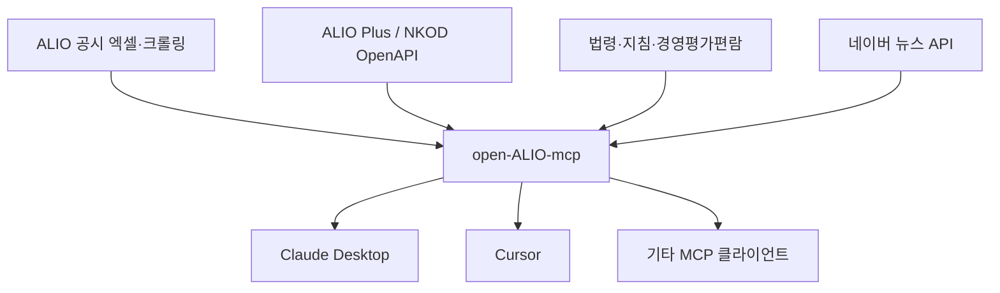
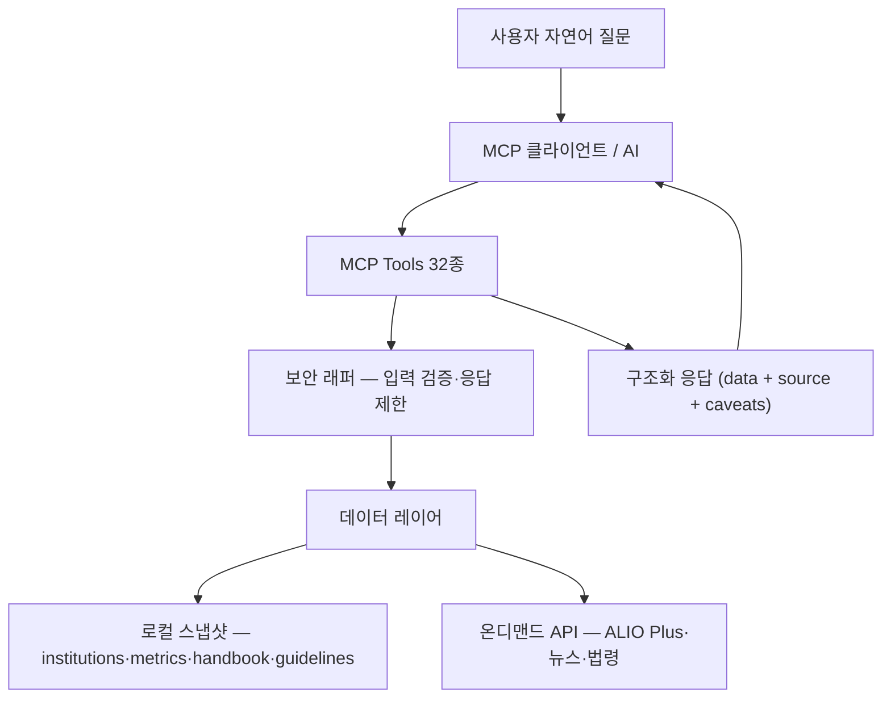

# open-ALIO-mcp — 공공기관 정보 MCP 서버

Open-source MCP server for Korean public institution information based on ALIO and ALIO Plus.

ALIO·ALIO Plus 기반 **공공기관 경영공시**와 **정부·공공기관 관련 법령·지침·대국민서비스** 정보를
AI 클라이언트(Cursor, Claude Desktop 등)가 조회·분석할 수 있도록 연결하는
MCP(Model Context Protocol) 서버입니다.

> "한국전력공사의 최근 5년 정원·부채 추이를 보여줘" — 이 한 문장이면 됩니다.

## 왜 이 프로젝트인가 (Why this matters)

공공기관 정보는 ALIO에 이미 공개되어 있습니다. 그러나 일반 국민과 실무자가
**원하는 질문 단위**로 접근하기는 어렵습니다.

- 특정 기관의 최근 5년 재무현황은? 유사 기관끼리 정원·부채·보수를 비교하면?
- 이 기관은 어느 부처 소관이고, 채용·시설·서비스 정보는 어디서 확인하나?
- ALIO 공시 수치와 최근 뉴스 보도가 일치하나?

open-ALIO-mcp는 이런 질문에 AI가 바로 답할 수 있도록 공공기관 정보를 MCP tool로
구조화한 **공공데이터 접근성 개선 프로젝트**입니다. Generic web search가 아니라
**한국 공공기관 도메인에 특화**된 MCP 서버로, 기관 식별·주무부처·정원/현원·재무지표·
대국민서비스·법령/지침·경영평가까지 공공기관 분석에 필요한 핵심 도메인 구조를 담고 있습니다.

이 프로젝트에서 가장 어려운 부분은 API 하나를 연결하는 것이 아니라,
**AI가 안전하게 조회·비교·설명할 수 있는 형태로 한국 공공기관 정보를 모델링하는 것**이며,
그 기반은 이미 갖춰져 있습니다. 모든 응답이 출처·기준연도·단위·유의사항을 포함하는
source-aware 설계이므로, 출처 추적성이 중요한 공공부문 활용에 적합합니다.

## 이 MCP로 할 수 있는 것

| 영역 | 대표 기능 |
|---|---|
| **기관·경영공시** | 355개 ALIO 공시 단위(342개 독립 지정기관 + 13개 부설기관) 검색, 11종 지표 시계열·비교·스크리닝, 경영공시 항목 카탈로그 |
| **대국민서비스** | 채용공고·개방시설·국가사업 검색, 기관 지점 조회 |
| **분석·검증** | 기관 360° 브리핑, 뉴스↔지표 교차검증, 채용·뉴스 분포 집계 |
| **법령·지침** | 공공기관 맥락 법령·행정규칙 조회, 로컬 지침(HWPX/PDF) 조문 검색 |
| **경영평가** | 경영평가편람 지표·배점·본문 검색, 연도별 변경 추적 |

자연어 질문 하나로 AI가 위 도구를 조합해 **출처·단위·유의사항**과 함께 답합니다.

## 기대 효과

### 일반 국민
- 공공기관 **채용·개방시설·지원사업**을 한곳에서 검색 — 기관명 별칭(한전·LH 등)만 알아도 조회 가능
- "이 기관이 뭐 하는 곳인지" **설립목적·주요기능**을 공식 공시 기반으로 확인
- 기관 관련 **최신 뉴스**를 동음이의어·중복기사를 걸러 받아볼 수 있음

### 공공기관 종사자
- 우리 기관과 **동종 기관의 인력·보수·복지·재무** 지표를 ALIO 공시 수치로 바로 비교
- **정원 vs 현원**을 구분한 인력현황 요약으로 "몇 명 재직?" 질의에 명확히 답변
- 공시 **주기·항목 분류**를 카탈로그로 확인해 "언제·무엇이 공개되는지" 파악

### 유관 부서·공무원
- 산하·동종 기관 **다건 비교·스크리닝**으로 국감·기능조정·정책 브리핑 초안 작성 시간 단축
- 언론 이슈와 **실제 공시 지표를 교차검증** — 보도와 수치의 괴리를 한 번에 확인
- **공운법·경영지침·예산운용지침** 등 공공기관 업무 맥락 법령·지침을 AI 대화 안에서 조회
- **경영평가편람** 지표·배점·세부평가내용 검색으로 평가 준비·변경 추적 지원

### 데이터·연구 활용
- 모든 응답에 `source`(출처·기준연도)와 `caveats`(유의사항) 포함 — **추정 대신 결측** 명시
- 채용·지표 **분포 집계**로 수도권 편중, NCS 직무별 수요 등 거시 패턴 분석
- ALIO 공시 페이지에서 수집·검증한 값까지 병합해 xlsx 미제공 항목으로 **원천 데이터 확장**
  (수집 파이프라인은 별도 데이터 저장소에서 관리)

## 현재 상태 (Current status)

**기능 구현 완료, 운영 전환 전 단계의 early-stage 프로토타입.**
MCP **Tools 32개** · **Prompts 2종** · **Resources 5종**.

- 지금 바로 적합한 용도: **로컬 MCP 사용, 공공부문 AI 실험, 개인 분석**
- 공개 HTTP/SSE 배포 전 필요한 보강: 인증, rate limit, 감사로그, 데이터 갱신 자동화 등
  운영 통제(operational hardening) — 자세한 내용은 [SECURITY.md](SECURITY.md)와
  [docs/roadmap.md](docs/roadmap.md) 참조

어려운 도메인 모델링(기관 식별·별칭, 공시 주기, 정원/현원 구분, 지표 단위, 출처 표기)은
대부분 프로젝트 안에 이미 구현되어 있고, 남은 과제는 주로 패키징·테스트·데이터 갱신·배포
통제 같은 운영 영역입니다. 이 저장소는 향후 **한국 공공부문 AI 지식 레이어(public-sector
AI knowledge layer)**로 확장하기 위한 기반(foundation)으로 설계되었습니다.

| 데이터 소스 | 용도 |
|---|---|
| NKOD OpenAPI 4종 (ALIO Plus) | 기관·지점·채용·시설·국가사업 |
| ALIO 항목별 공시 엑셀 11종 | 지표 시계열 (기관·연도는 카테고리별 — `list_metric_categories` 참조) |
| ALIO 공시 카탈로그·크롤링 | 경영공시 50개 항목(세부 92종) 메타 + HTML 표 수집 |
| 네이버 뉴스 API | 기관별 뉴스·이슈 검색 |
| 국가법령정보센터 Open API | 법령·행정규칙 |
| 로컬 지침·경영평가편람 | HWPX/PDF 파싱 적재 |

> 기관 수 355개는 ALIO 공시 단위 기준이며 부설기관 13개를 포함합니다. 독립 지정 기관 수는 342개이고,
> MCP 응답의 `is_subsidiary`, `parent_org_code`, `classification_org_type`으로 구분합니다.

## 아키텍처 (Architecture)

데이터 흐름:



질의 처리 구조:



상세 구조는 [docs/architecture.md](docs/architecture.md) 참조.

---

## MCP 기능 상세

### Tools (32개)

#### 1. 기관 검색·프로필

| Tool | 설명 |
|---|---|
| `search_institutions` | 기관 검색 — 별칭·부분일치 fallback(한전·심평 등), 관련도 정렬 |
| `get_institution_profile` | 기관 프로필 + 일반현황(설립목적·경영목표·기관장·주요기능 등) |
| `get_institution_branches` | 기관 지점·사업소 목록 |

#### 2. 경영공시·지표

| Tool | 설명 |
|---|---|
| `list_metric_categories` | 공시 지표 카테고리 11종 목록 |
| `list_metric_items` | 카테고리 내 지표 항목명 탐색 |
| `list_disclosure_items` | ALIO 경영공시 항목 카탈로그 — 정기/수시·공시주기·ESG 분류 (50개·세부 92종) |
| `get_institution_metrics` | 지표 시계열 조회 (정원·보수·부채·예산 등, 연도는 카테고리별) |
| `get_institution_staff_summary` | 인력현황 요약 — **정원(authorized) vs 현원(actual)** 구분, headcount 추정 |
| `compare_institutions` | 2~5개 기관 지표 나란히 비교 |
| `find_institutions_by_criteria` | 조건 스크리닝 — 지표 상·하위, 증감률 상위 (org_type·부처 필터) |

> 지표 응답에는 **공시 주기 주석**이 자동 부착되며, 데이터가 비어 있으면
> "공시 주기 미도래·미공시 가능성" 안내가 `caveats`에 추가됩니다.

#### 3. 대국민서비스 (ALIO Plus)

| Tool | 설명 |
|---|---|
| `search_public_services` | 국가사업·대민 지원 서비스 검색 |
| `search_facilities` | 개방시설 검색 — 예약 링크·수용인원·운영시간, 통합 query·페이지네이션 |
| `get_facility_profile` | 개방시설 상세 |
| `search_recruitments` | 채용공고 검색 — 기관명 자동 해석, 마감임박·NCS·학력·우대조건·취소공고 제외 |
| `get_recruitment_profile` | 채용공고 상세 — 전형단계·모집요강·지원 링크 |
| `analyze_recruitments` | 진행중 채용 분포 집계 — 지역·직무·고용형태·학력·기관별 공고수/모집인원 |

#### 4. 뉴스·통합 분석

| Tool | 설명 |
|---|---|
| `get_institution_news` | 기관별 뉴스 검색 — 공식명+별칭 OR 검색, 동음이의어 제외, 중복 제거, 기간 커버리지 진단 |
| `get_institution_briefing` | **360° 브리핑** — 프로필 + 핵심지표 추세 + 최근 뉴스 + 진행중 채용 |
| `cross_check_news_with_metrics` | **뉴스↔지표 교차검증** — 토픽(부채·정원·보수 등)을 지표로 매핑, 시계열+뉴스+공시주기 |
| `digest_institution_news` | 뉴스 테마 분류·집계 — 재무/채용/안전/감사/사업/정책/ESG + 타임라인 |

> `get_institution_news`는 org_code 없이 query만으로도 동작합니다.
> sort='date'일 때 기간을 벗어나면 조기 종료해 API 호출을 줄이며,
> 보도량이 많아 기간을 다 못 덮으면 `caveats`로 알립니다.

#### 5. 법령·행정규칙·지침

| Tool | 설명 |
|---|---|
| `search_laws` / `get_law_text` | 법령 검색·조문 조회 — 공운법 등 화이트리스트 가이드, 목차 모드 + 조문 지정 |
| `search_admin_rules` / `get_admin_rule_text` | 행정규칙(훈령·예규·고시·지침) 검색·본문 — 경영지침·혁신지침 등 |
| `search_guidelines` / `get_guideline_text` | 로컬 지침 조문 검색·조회 — law.go.kr 미등재 연도별 시달 지침(HWPX/PDF) |

#### 6. 경영평가편람

| Tool | 설명 |
|---|---|
| `search_evaluation_handbook` | 편람 본문 키워드 검색 — 중대재해·총인건비·안전관리등급 등, part·year 필터 |
| `list_evaluation_org_types` | 편람에 정의된 기관 유형(공기업 SOC·에너지, 준정부 기금관리형 등) |
| `list_evaluation_indicators` | 유형별 평가지표·배점(계·비계량·계량) 표 |
| `get_evaluation_indicator_detail` | 지표명으로 세부평가내용·배점·지표정의 조회 |
| `compare_evaluation_handbook_years` | 두 연도 편람에서 동일 키워드 검색 — 변경 추적 보조 |

#### 7. 운영

| Tool | 설명 |
|---|---|
| `get_server_status` | 서버·데이터 적재 상태 점검 (기관·지표·공시·채용스냅샷·편람·지침) |

### Prompts (2종)

| Prompt | 용도 |
|---|---|
| `summarize_disclosure` | 기관 1곳 공시 요약 — 개요·인력·보수·재무·출처 고정 양식 |
| `policy_brief` | 기관 비교 기반 1쪽 정책 브리핑 — 판단성 결론 금지 규칙 내장 |

### Resources (5종)

| Resource URI | 내용 |
|---|---|
| `alio://disclosure-catalog` | ALIO 경영공시 항목 카탈로그 (50개·세부 92종, 정기/수시·주기·metric 매핑) |
| `alio://metric-categories` | 보유 지표 카테고리 인덱스 |
| `alio://related-laws` | 공공기관 핵심 법령·행정규칙 화이트리스트 (공운법 18종 + 기재부 지침 6종) |
| `alio://handbook-index` | 경영평가편람 적재 목록 |
| `alio://guideline-index` | 로컬 적재 지침 목록 |

### 지표 카테고리 (`data/metrics/`)

아래 **공시 기관 수·연도**는 `data/metrics/_index.json`에 집계되어 있습니다.
최신 값은 MCP tool `list_metric_categories` 또는 `get_server_status`로 확인하세요.

| category | 내용 | 공시 기관 수 | 연도 | 단위 |
|---|---|---:|---|---|
| `staff` | 임직원 정원·현원 | 355 | 2021–2026 | 명 |
| `salary` | 직원 평균보수·신입초임 | 355 | 2021–2026 | 천원 |
| `executive_pay` | 임원 연봉 | 343 | 2021–2026 | 천원 |
| `recruitment` | 신규채용·청년인턴 | 355 | 2021–2026 | 명 |
| `budget` | 수입·지출, 정부순지원수입 | 354 | 2021–2026 | 백만원 |
| `welfare` | 복리후생비 | 355 | 2021–2025 | 천원 |
| `welfare_etc` | 그 밖의 복리후생제도 | 305 | 2021–2025 | 천원 |
| `work_life` | 육아휴직·유연근무 등 | 355 | 2021–2025 | 명 |
| `tax` | 법인세 | 338 | 2021–2025 | 천원 |
| `head_expense` | 기관장 업무추진비 | 351 | 2021–2025 | 천원 |
| `finance` | 요약 재무상태표·손익 | 355 | 2021–2025 | 백만원 |

> **데이터 승격 주의:** `finance`, `budget`, `executive_pay`는 엑셀 기반 metrics에 ALIO 공시 검증값을 병합합니다.
> 같은 기관·항목·연도에서 값이 충돌하는 그룹은 자동 선택하지 않고 기존 엑셀 값을 fallback으로 유지합니다.
> 이 저장소에는 병합이 끝난 런타임 데이터만 포함되며, 원천 수집·승격 파이프라인은 별도 데이터 저장소에서 관리합니다.

---

## 설치

### Quick start with uvx

PyPI 배포판은 소스 체크아웃 없이 바로 실행할 수 있습니다.

```powershell
uvx open-alio-mcp
```

첫 실행 때 로컬 `data/` 디렉터리가 없으면 GitHub Release의 `alio_snapshot.db`를 사용자 데이터 디렉터리로 자동 다운로드합니다. 이 스냅샷만으로 기관 검색, 주요 공시 지표, 공시 항목 카탈로그, 지침·경영평가편람 검색을 사용할 수 있습니다.

### API key setup

기본 스냅샷 조회에는 API 키가 없어도 됩니다. 다만 라이브 채용·시설·사업 조회, 뉴스 검색, 법령·행정규칙 조회를 쓰려면 아래 키를 설정하세요.

| 환경변수 | 필요한 기능 | 발급 위치 |
|---|---|---|
| `DATA_GO_KR_SERVICE_KEY` | ALIO Plus 라이브 API: 채용·시설·사업·지점 등 | [data.go.kr](https://www.data.go.kr) |
| `NAVER_CLIENT_ID`, `NAVER_CLIENT_SECRET` | 기관별 뉴스 검색·이슈 분석 | [developers.naver.com](https://developers.naver.com) |
| `LAW_API_OC` | 국가법령정보센터 법령·행정규칙 검색 | [open.law.go.kr](https://open.law.go.kr) |

`DATA_GO_KR_SERVICE_KEY`는 공공데이터포털에서 "기획재정부_공공기관 정보 조회 서비스"를 활용 신청한 뒤 **일반 인증키(Decoding)** 값을 사용합니다.

`LAW_API_OC`는 국가법령정보센터 회원가입 후 "Open API 사용 신청"으로 발급받는 OC 값입니다. 보통 가입 이메일의 ID 부분입니다. 예를 들어 `hong@example.com`이면 `hong` 형태입니다.

`NAVER_CLIENT_ID`와 `NAVER_CLIENT_SECRET`은 네이버 개발자센터에서 애플리케이션을 등록하고 "검색" API 사용을 활성화해 발급받습니다.

### Source checkout

Source checkout:

```powershell
git clone https://github.com/gitbosung/open-ALIO-mcp.git open_alio_mcp
cd open_alio_mcp
python -m venv .venv
.venv\Scripts\activate
pip install -e .
copy .env.example .env   # 발급받은 키 입력
```

`.env` (키 발급: [data.go.kr](https://www.data.go.kr) → "공공기관 정보 조회서비스" 등 활용신청, Decoding 키 사용):

```
DATA_GO_KR_SERVICE_KEY=발급받은_일반인증키_Decoding값

# (선택) 기관별 뉴스 검색용 — developers.naver.com 앱 등록 후 '검색' API 키 발급
NAVER_CLIENT_ID=
NAVER_CLIENT_SECRET=

# (선택) 법령·행정규칙 조회용 — open.law.go.kr 회원가입 → 'Open API 사용 신청' → OC 발급
# OC는 가입 이메일의 ID 부분 (예: hong@gmail.com → hong)
LAW_API_OC=
```

### Run

```powershell
open-alio-mcp
python -m open_alio_mcp
uv run open-alio-mcp
```

Claude Desktop / MCP client package run after publishing. API 키가 필요 없으면 `env` 블록은 생략해도 됩니다.

```json
{
  "mcpServers": {
    "open-alio": {
      "command": "uvx",
      "args": ["open-alio-mcp"],
      "env": {
        "DATA_GO_KR_SERVICE_KEY": "발급받은_일반인증키_Decoding값",
        "NAVER_CLIENT_ID": "",
        "NAVER_CLIENT_SECRET": "",
        "LAW_API_OC": ""
      }
    }
  }
}
```

Runtime data is loaded from `data/` during source checkout development. Package installs can use `OPEN_ALIO_DATA_DIR`, `OPEN_ALIO_SNAPSHOT_PATH`, or the GitHub Release `alio_snapshot.db` downloaded by `ensure_snapshot()`.

Claude Desktop 설정 파일 위치:

| 앱 | Windows | macOS |
|---|---|---|
| Claude Desktop | `%APPDATA%\Claude\claude_desktop_config.json` | `~/Library/Application Support/Claude/claude_desktop_config.json` |
| Cursor | 프로젝트 `.cursor/mcp.json` 또는 전역 설정 | 프로젝트 `.cursor/mcp.json` 또는 전역 설정 |
| Windsurf | 프로젝트 `.windsurf/mcp.json` | 프로젝트 `.windsurf/mcp.json` |

Claude.ai 웹의 원격 Connector URL 방식은 이 저장소에서 아직 제공하지 않습니다. 현재 배포판은 로컬 stdio MCP 서버로 실행됩니다.

데이터를 직접 지정해야 하는 환경에서는 아래 변수를 사용합니다.

```powershell
$env:OPEN_ALIO_SNAPSHOT_PATH="C:\path\to\alio_snapshot.db"
uvx open-alio-mcp
```

Troubleshooting:

- `uvx`를 찾을 수 없으면 [uv 설치 문서](https://docs.astral.sh/uv/)에 따라 `uv`를 설치한 뒤 새 터미널을 여세요.
- `DATA_GO_KR_SERVICE_KEY` 오류가 나면 Encoding 키가 아니라 **Decoding 일반 인증키**를 넣었는지 확인하세요.
- `LAW_API_OC` 오류가 나면 open.law.go.kr의 사용 신청 승인 여부와 OC 값을 확인하세요.
- 스냅샷 다운로드가 실패하면 GitHub Release에서 `alio_snapshot.db`와 `alio_snapshot.db.sha256`을 직접 내려받아 `OPEN_ALIO_SNAPSHOT_PATH`로 지정하세요.

## Security Notes

- API 키는 코드·README·테스트 파일에 직접 작성하지 말고 `.env` 또는 배포 환경변수로만 관리하세요.
- API 키를 URL query parameter로 전달하지 마세요. 브라우저 기록, 프록시, 서버 로그에 남을 수 있습니다.
- `.env`, `.env.local`, `.env.*`, 로그 파일은 `.gitignore`에 포함되어 있으며 커밋하지 않습니다.
- 외부 API 오류 로그는 `serviceKey`, `OC`, `NAVER_CLIENT_SECRET` 등 민감값을 마스킹합니다.
- MCP tool 입력값은 공통 보안 래퍼에서 길이·범위·허용값을 검증하고, 긴 응답은 `MAX_RESPONSE_CHARS`와 `MAX_ITEMS_PER_TOOL` 기준으로 제한됩니다.
- 현재 `open-alio-mcp` / `python -m open_alio_mcp` 기본 실행은 stdio MCP입니다. HTTP/SSE로 공개 배포하는 경우에는 별도 reverse proxy 또는 앱 서버에서 rate limit, CORS allowlist, security headers를 반드시 적용하세요.
- 운영·공개 배포에서 `CORS_ORIGIN=*`를 사용하지 말고 공식 서비스 도메인만 허용하세요.
- 사내 내부망 도입 전에는 SSO/인증 연계, 사용자 식별 감사로그, 내부 데이터와 공개 데이터 tool 분리 정책을 확정하세요.

## 데이터 갱신·스냅샷 빌드

이 저장소는 **병합이 끝난 런타임 데이터(`data/`)와 배포 패키지**만 포함합니다.
ALIO 공시 엑셀·크롤 수집·파싱·검증·승격으로 `data/`를 만들어내는 **데이터 빌드 파이프라인은
별도 데이터 저장소**에서 관리합니다. 새 공시 반영은 파이프라인 저장소에서 `data/`를 갱신한 뒤,
런타임 부분집합을 이 저장소로 동기화하고 아래로 배포 스냅샷을 빌드·릴리스합니다.

```powershell
.venv\Scripts\python scripts\build_snapshot.py            # data/ → dist/alio_snapshot.db
.venv\Scripts\python tests\test_smoke.py                  # 오프라인 기능 스모크
.venv\Scripts\python scripts\security_smoke_test.py       # 입력 검증 스모크
```

빌드한 `dist/alio_snapshot.db`와 `dist/alio_snapshot.db.sha256`을 GitHub Release에 올리면
`uvx open-alio-mcp` 사용자가 자동으로 내려받습니다.

## 법령·지침·경영평가편람

**법령·행정규칙**은 국가법령정보센터 Open API를 온디맨드로 검색합니다 (로컬 적재 없음).
공공기관 맥락 질의는 `alio://related-laws` 화이트리스트(공운법·계약사무규칙·경영지침 등)의
공식 명칭으로 검색해 정확도를 높입니다. `get_law_text`는 기본 **목차 모드**이며,
`article='11'`처럼 조문을 지정해 본문을 받을 수 있습니다.

**지침**은 이원화합니다. 「경영에 관한 지침」 등 상시 지침은 law.go.kr 행정규칙으로 조회하고,
연도별 시달 지침(예산운용지침 등)은 파일을 파싱해 `data/guidelines/`에 적재합니다.

**경영평가편람**은 HWPX/PDF를 파싱해 `data/handbook/`에 적재합니다.
`alio://handbook-index`로 보유 연도·part를 확인한 뒤 검색 도구를 사용하세요.
지침·편람의 원본 적재·파싱도 데이터 파이프라인 저장소에서 수행합니다.

## Cursor / Claude Desktop 연결

프로젝트 루트에서 `pip install -e .` 후 콘솔 스크립트 또는 패키지 모듈을 stdio MCP로 실행합니다.

**Cursor** — `.cursor/mcp.json` 또는 전역 `~/.cursor/mcp.json`:

```json
{
  "mcpServers": {
    "open-ALIO-mcp": {
      "command": ".venv/Scripts/python.exe",
      "args": ["-m", "open_alio_mcp"],
      "cwd": "C:/path/to/open_alio_mcp"
    }
  }
}
```

macOS/Linux는 `command`를 `.venv/bin/python`으로, `cwd`를 실제 경로로 바꿉니다.

**Claude Desktop** — 배포 후에는 `uvx` 한 줄 구성을 권장합니다.
라이브 API 키가 필요하면 위 설치 섹션의 `env` 예시처럼 MCP 설정에 환경변수를 추가합니다.

```json
{
  "mcpServers": {
    "open-alio": {
      "command": "uvx",
      "args": ["open-alio-mcp"]
    }
  }
}
```

로컬 체크아웃을 직접 연결할 때는 위 Cursor 예시와 같은 `.venv` Python 구성을 사용합니다.

연결 확인: AI에게 `get_server_status` 실행을 요청하거나,
"ALIO 지표 카테고리 목록 보여줘"처럼 자연어로 질의합니다.

---

## 사용자별 활용법

아래 질문 예시는 AI가 적절한 tool을 **자동 조합**해 답변합니다.

### 일반 국민 — 채용·시설·기관 이해

| 질문 예시 | 활용 tool | 기대 효과 |
|---|---|---|
| "강남구에서 무료로 빌릴 수 있는 공공기관 회의실 알려줘" | `search_facilities` | 예약 링크·수용인원까지 바로 확인 |
| "이번 주 마감인 채용공고만 마감 빠른 순으로" | `search_recruitments` | 놓치기 쉬운 마감임박 공고 우선 표시 |
| "한전 채용 떴어?" | `search_recruitments` | '한전' → 한국전력공사 자동 해석 |
| "청년이 신청할 수 있는 공공기관 지원 서비스" | `search_public_services` | 대상·키워드별 국가사업 탐색 |
| "한국토지주택공사는 뭐 하는 기관이야?" | `get_institution_profile` | 설립목적·주요기능 공식 공시 기반 설명 |
| "한전 요즘 무슨 이슈 있어?" | `get_institution_news` | 별칭 확장·중복 제거된 뉴스 목록 |

### 공공기관 종사자 — 동종 비교·인력·공시 주기

| 질문 예시 | 활용 tool | 기대 효과 |
|---|---|---|
| "우리 기관이랑 비슷한 공기업들 평균보수 비교" | `compare_institutions` | 2~5개 기관 수치 나란히 비교 |
| "우리 기관 정원·현원 몇 명이야?" | `get_institution_staff_summary` | 정원 vs 현원 구분 명확화 |
| "동종 공기업 중 복리후생비 상위 기관은?" | `find_institutions_by_criteria` | 조건 스크리닝으로 벤치마크 후보 추출 |
| "직원 평균보수는 매년 언제 공시돼?" | `list_disclosure_items` | 정기/수시·분기 주기 확인 |
| "우리 기관 부채비율이 동종 대비 어느 수준이야?" | `find_institutions_by_criteria` + `get_institution_metrics` | 상대 위치 + 추이 동시 파악 |

### 유관 부서·공무원 — 정책·국감·법령·평가

| 질문 예시 | 활용 tool | 기대 효과 |
|---|---|---|
| "산업부 산하 공기업 전체 정원 5년 추이" | `search_institutions` + `get_institution_metrics` | 부처 필터 다건 집계 |
| "부채 증가율 상위 공기업과 부채비율 추이" | `find_institutions_by_criteria` | 스크리닝 후 심층 조회 |
| "LH 한눈에 브리핑 (현황·재무·뉴스·채용)" | `get_institution_briefing` | 360° 원샷 종합 |
| "뉴스에서 LH 빚 많다는데 실제 부채비율은?" | `cross_check_news_with_metrics` | 보도 vs 공시 수치 대조 |
| "캠코 최근 이슈를 주제별로 정리" | `digest_institution_news` | 재무/안전/ESG 등 테마별 타임라인 |
| "○○공단 공시 한눈에 요약" | `summarize_disclosure` (prompt) | 고정 양식 공시 요약 |
| "기관 비교 1쪽 정책 브리핑 초안" | `policy_brief` (prompt) | 판단성 결론 없는 브리핑 초안 |
| "공운법상 경영공시 의무 조항 원문" | `search_laws` → `get_law_text` | 조문 지정 조회로 컨텍스트 절약 |
| "예산운용지침 총인건비 인상률 몇 %?" | `search_guidelines` → `get_guideline_text` | 연도별 시달 지침 조문 검색 |
| "2026 경영평가 안전관리 지표 배점은?" | `get_evaluation_indicator_detail` | 편람 세부평가내용·배점 조회 |
| "2025→2026 편람 총인건비 관련 변경" | `compare_evaluation_handbook_years` | 연도별 키워드 검색 결과 대조 |

### 데이터·연구 — 교차 분석·출처 검증

| 질문 예시 | 활용 tool | 기대 효과 |
|---|---|---|
| "한국도로공사 5년 1인당 부채 계산" | `get_institution_metrics` (finance + staff) | 지표 교차 파생 계산 |
| "진행중 채용 NCS 직무별 공고·모집인원 집계" | `analyze_recruitments` | 채용 시장 거시 패턴 |
| "공공기관 채용 수도권 vs 지방 분포" | `analyze_recruitments` (region) | 지역 편중 분석 |
| "이 수치 어디서 나온 거야?" | (모든 tool 응답) | `source`·`as_of_year`·`caveats` 확인 |
| "서버 데이터 적재 상태 확인" | `get_server_status` | 데모·운영 전 점검 |

> **신뢰성 설계**: 데이터가 없으면 추정하지 않고 **결측**으로 답하며,
> 공시 주기 기준으로 공백 사유를 안내합니다.

---

## 검증 현황 (Tool verification status)

핵심 도구는 `tests/test_smoke.py`(오프라인 기능·CI)와 `scripts/security_smoke_test.py`(입력 검증)로
스모크 테스트를 수행하며, 한국전력공사·LH·국립공원공단 등 대표 기관 시나리오를 포함합니다.
원천 데이터의 파싱·라이브 ALIO 대조 검증은 데이터 파이프라인 저장소에서 수행합니다.

| 도구 그룹 | 검증 수준 | 비고 |
|---|---|---|
| 기관 검색·프로필 | 자동 스모크 테스트 | 별칭·부설기관 케이스 포함 |
| 경영공시·지표 (시계열·비교·스크리닝) | 자동 스모크 테스트 | 크롤 승격값은 교차검증 후 병합 |
| 대국민서비스 (채용·시설·사업) | 자동 스모크 테스트 | 라이브 API — 키 필요, `--offline` 시 생략 |
| 법령·지침 | 자동 스모크 테스트 | 법령은 키 설정 시에만 실행 |
| 뉴스·통합 분석 (브리핑·교차검증) | 수동 시나리오 검증 | 자동 테스트 보강 예정 — 결과 caveats 확인 |
| 경영평가편람 | 수동 시나리오 검증 | 자동 테스트 보강 예정 — 원문 대조 권장 |

도구별 상세 검증표·테스트 계획은 [docs/testing.md](docs/testing.md) 참조.
fixture 기반 회귀 테스트와 CI 확대는 로드맵에 포함되어 있습니다.

## 폴더 구조

런타임 패키지 코드는 `src/open_alio_mcp/` 아래에 있습니다.

| 경로 | 용도 |
|---|---|
| `src/open_alio_mcp/server.py` | MCP 서버 진입점 (Tools 32 · Prompts 2 · Resources 5) |
| `src/open_alio_mcp/alio_client.py` | NKOD OpenAPI 4종 wrapper |
| `src/open_alio_mcp/naver_client.py` | 네이버 뉴스 API wrapper |
| `src/open_alio_mcp/law_client.py` | 국가법령정보센터 Open API wrapper |
| `src/open_alio_mcp/guideline_store.py` | 로컬 지침 조문 검색·조회 |
| `src/open_alio_mcp/handbook_store.py` | 경영평가편람 검색·지표·연도 비교 |
| `src/open_alio_mcp/news_insights.py` | 뉴스 테마 분류·토픽↔지표 매핑 |
| `src/open_alio_mcp/metrics_store.py` | 지표 JSON 조회·스크리닝·인력 요약 |
| `src/open_alio_mcp/disclosure_store.py` | ALIO 공시항목 카탈로그 |
| `src/open_alio_mcp/recruit_store.py` | 채용 스냅샷·분포 집계 |
| `scripts/` | 스냅샷 빌드(`build_snapshot.py`) + 스모크 테스트 |
| `tests/` | 오프라인 CI 스모크 테스트 (GitHub Actions에서 자동 실행) |
| `docs/` | 아키텍처·데이터 출처·테스트·로드맵 문서 |
| `examples/` | 질의 예시·기대 동작 |
| `data/` | 런타임 데이터 — institutions, aliases, metrics/, snapshots/, reference/, guidelines/, handbook/ |

> 데이터 수집·빌드 파이프라인(크롤러·파서·빌드 스크립트·원본 rawdata)은 별도 데이터 저장소에서 관리합니다.

## 데이터 출처·한계

- 모든 응답에 출처(`source`)와 유의사항(`caveats`)이 포함됩니다.
- 원천: 재정경제부 NKOD OpenAPI(공공데이터포털·ALIO Plus) + ALIO 항목별 공시 엑셀 + ALIO 공시 페이지 크롤링 + 네이버 뉴스 검색 API + 국가법령정보센터 Open API(법제처) + 사용자 투입 지침·경영평가편람 파일.
- 법령·행정규칙은 현행 기준 조회 결과이며 **법률 자문이 아닙니다**. 로컬 지침·편람은 파일 추출 텍스트라 표·서식이 손실될 수 있어 인용 시 원문 대조를 권장합니다.
- 뉴스 결과는 **언론 보도**이며 기관의 공식 입장·공시 정보가 아닙니다.
- 공시 수치 기준이며 **기관 평가·정책 판단의 근거가 아닙니다**.
- 금액 단위는 카테고리별로 다릅니다(천원/백만원) — 응답 `unit` 필드 확인.

데이터 카테고리별 출처·갱신주기·갱신 방법은 [docs/data_sources.md](docs/data_sources.md) 참조.

## 로드맵 (Roadmap)

| 단계 | 목표 | 상태 |
|---|---|---|
| Phase 1 — 로컬 MCP 프로토타입 | ALIO/ALIO Plus 연결, 기관 검색·지표·비교, 출처 표기 | **완료** |
| Phase 2 — 신뢰 가능한 오픈소스 MCP | 테스트 자동화·CI, 데이터 갱신 스크립트, 문서·예시 정비 | 진행 중 |
| Phase 3 — 공공부문 AI 지식 레이어 | 국회·나라장터·경영평가 결과 등 확장, 기관 지식카드, 데이터 거버넌스 | 계획 |
| Phase 4 — 운영 배포 | 인증, rate limit, 감사로그, 모니터링, 정기 데이터 갱신, 공공기관 보안 검토 | 계획 |

상세 로드맵은 [docs/roadmap.md](docs/roadmap.md) 참조.

> 어려운 도메인 모델링 작업의 대부분은 이미 프로젝트에 구현되어 있으며,
> 남은 작업은 주로 패키징·테스트·데이터 갱신·배포 통제 같은 운영 보강입니다.

## 문서 (Documentation)

| 문서 | 내용 |
|---|---|
| [docs/architecture.md](docs/architecture.md) | 모듈·데이터 레이어 구조 |
| [docs/data_sources.md](docs/data_sources.md) | 데이터 출처·기준일·갱신주기·갱신 절차 |
| [docs/testing.md](docs/testing.md) | 도구별 검증표·테스트 계획 |
| [docs/roadmap.md](docs/roadmap.md) | 단계별 로드맵 |
| [SECURITY.md](SECURITY.md) | 보안 정책 — 로컬 사용 기준과 공개 배포 전 점검 항목 |
| [examples/prompts.md](examples/prompts.md) | 사용자 유형별 질의 예시 모음 |
| [examples/sample_outputs.md](examples/sample_outputs.md) | 대표 질의의 기대 동작·응답 형식 |

## 라이선스 (License)

[MIT License](LICENSE)
