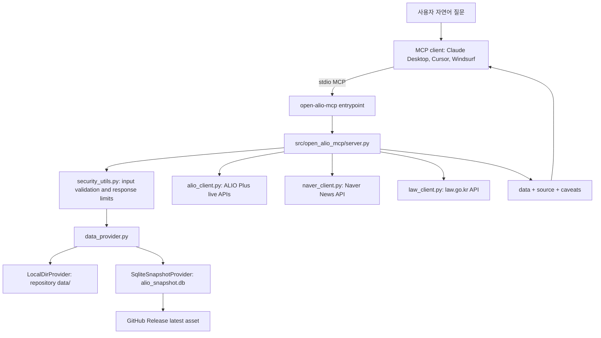

# Architecture

open-ALIO-mcp는 로컬 stdio MCP 서버입니다. 배포판 사용자는 `uvx open-alio-mcp`를 실행하고, 개발자는 `python -m open_alio_mcp` 또는 editable install 후 `open-alio-mcp`를 실행합니다.

## Runtime Overview



## Entrypoints

| 실행 방식 | 용도 |
|---|---|
| `uvx open-alio-mcp` | 최종 사용자 권장 실행 방식 |
| `open-alio-mcp` | 설치된 패키지의 console script |
| `python -m open_alio_mcp` | 개발/디버깅용 모듈 실행 |

`pyproject.toml`의 console script는 `open_alio_mcp.__main__:main`을 호출하고, `__main__.py`는 `server.mcp.run()`을 실행합니다.

## Package Layout

| 경로 | 책임 |
|---|---|
| `src/open_alio_mcp/server.py` | MCP tool, prompt, resource 정의와 응답 조립 |
| `src/open_alio_mcp/data_provider.py` | 런타임 데이터 공급자 선택 |
| `src/open_alio_mcp/snapshot.py` | SQLite snapshot pack, validate, download |
| `src/open_alio_mcp/security_utils.py` | tool 입력 검증, 응답 크기 제한, 민감값 마스킹 |
| `src/open_alio_mcp/alio_client.py` | ALIO Plus/NKOD live API wrapper |
| `src/open_alio_mcp/metrics_store.py` | 공시 지표 JSON 조회, 비교, 스크리닝 |
| `src/open_alio_mcp/disclosure_store.py` | ALIO 공시 항목 카탈로그 |
| `src/open_alio_mcp/recruit_store.py` | 채용 snapshot 조회와 분포 집계 |
| `src/open_alio_mcp/guideline_store.py` | 로컬 지침 조문 검색 |
| `src/open_alio_mcp/handbook_store.py` | 경영평가편람 검색과 비교 |
| `src/open_alio_mcp/naver_client.py` | 네이버 뉴스 검색 API wrapper |
| `src/open_alio_mcp/law_client.py` | 국가법령정보센터 Open API wrapper |
| `src/open_alio_mcp/news_insights.py` | 뉴스 테마 분류와 지표 매핑 |

## Data Provider Resolution

런타임 데이터는 `data_provider.get_provider()`가 최초 호출 시 한 번 선택합니다.

1. `OPEN_ALIO_DATA_DIR`: 지정된 `data/` 디렉터리를 직접 읽습니다.
2. `OPEN_ALIO_SNAPSHOT_PATH`: 지정된 SQLite snapshot 파일을 읽습니다.
3. 소스 체크아웃의 `data/`: 저장소에서 실행 중이면 로컬 개발 데이터를 읽습니다.
4. 기본 사용자 데이터 디렉터리의 `alio_snapshot.db`: 없거나 손상되면 GitHub Release에서 자동 다운로드합니다.

패키지 설치 환경에는 저장소의 `data/`가 포함되지 않으므로, `uvx open-alio-mcp`는 보통 4번 경로를 사용합니다.

## Snapshot Format

`alio_snapshot.db`는 런타임에 필요한 JSON 문서를 SQLite에 zlib 압축 blob으로 저장합니다.

| 테이블 | 내용 |
|---|---|
| `meta` | `format_version`, `built_at`, `doc_count`, `raw_bytes` |
| `docs` | `path`, `content` |

필수 문서가 없거나 압축 해제가 실패하면 snapshot 검증이 실패합니다. 다운로드 시 `<asset>.sha256` sidecar가 있으면 SHA256도 검증합니다.

## API Calls

로컬 snapshot으로 처리할 수 없는 기능은 온디맨드 API를 호출합니다.

| API | 환경변수 | 사용 기능 |
|---|---|---|
| ALIO Plus/NKOD | `DATA_GO_KR_SERVICE_KEY` | 채용, 시설, 사업, 지점 등 live 조회 |
| Naver News | `NAVER_CLIENT_ID`, `NAVER_CLIENT_SECRET` | 기관별 뉴스와 이슈 분석 |
| law.go.kr | `LAW_API_OC` | 법령·행정규칙 검색과 조문 조회 |

API 키가 없어도 snapshot 기반 기관/지표/공시/지침/편람 조회는 동작합니다.

## Response Contract

대부분의 tool 응답은 다음 envelope를 사용합니다.

```json
{
  "data": {},
  "source": {
    "system": "ALIO",
    "api": "name",
    "url": "https://www.alio.go.kr",
    "retrieved_at": "2026-01-01T00:00:00"
  },
  "caveats": [],
  "is_error": false
}
```

응답은 수치의 출처, 기준연도, 단위, 공시 주기 차이, 결측 가능성을 `source`와 `caveats`에 명시하는 것을 원칙으로 합니다.

## Deployment Shape

현재 공개 배포는 PyPI 패키지와 GitHub Release snapshot의 조합입니다.

1. `pyproject.toml`로 wheel/sdist를 빌드합니다.
2. `scripts/build_snapshot.py`로 `dist/alio_snapshot.db`를 생성합니다.
3. `alio_snapshot.db`와 `.sha256`을 GitHub Release asset으로 올립니다.
4. wheel/sdist를 PyPI에 업로드합니다.
5. `uvx open-alio-mcp`로 PyPI 패키지를 설치하고, package runtime이 GitHub Release snapshot을 자동 다운로드합니다.

HTTP/SSE 공개 서버, Claude.ai 원격 Connector URL, 인증 게이트웨이는 아직 제공하지 않습니다. 해당 형태로 공개 배포할 경우 reverse proxy, 인증, rate limit, CORS allowlist, security headers, 감사 로그가 별도로 필요합니다.
